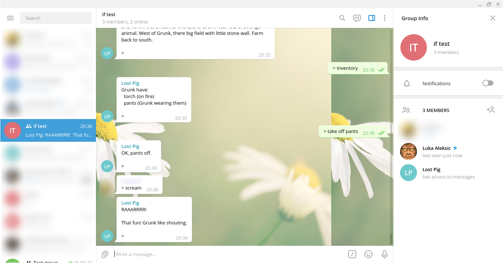

# Telegram Interactive Fiction Bot

A telegram bot that allows playing [interactive fiction](http://brasslantern.org/beginners/beginnersguide.html).

## Requirements

- A [TCL distribution](https://www.activestate.com/products/tcl/downloads/) with the `http`, `tsl` and `json` packages.

- An command line interactive fiction interpreter that works with stdin/stdout (no ncurses) and which signals that it's done with output and awaiting input by printing the ETX byte (0x03) on a line by itself. This can be any [GLK](https://www.eblong.com/zarf/glk/) enabled interpreter compiled with [my patched fork of CheapGLK](https://github.com/laleksic/cheapglk). Judging by the formats [Gargoyle](https://github.com/garglk/garglk/) supports, pretty much every IF format should have a GLK enabled interpreter.

- A telegram bot token. See [here](https://core.telegram.org/bots/#3-how-do-i-create-a-bot) for how to create one. Make sure to [disable privacy mode](https://core.telegram.org/bots#privacy-mode) for your bot -- this just means the bot has access to all messages posted in a group chat it is a member of.

## Usage

`tclsh telegram-if-bot.tcl YOUR-BOT-TOKEN INTERPRETER-COMMAND-LINE`

For example:

`tclsh telegram-if-bot.tcl 110201543:AAHdqTcvCH1vGWJxfSeofSAs0K5PALDsaw bocfel LostPig.z8`

The first chat the bot receives a message from since starting the script will be the chat that provides input to the IF interpreter. So create a group chat for all your players, add your bot and send any message to start the session. Messages prefixed with `>` will be understood by the bot as commands for the interpreter.

Example (private info censored):



```
tclsh telegram-if-bot/telegram-if-bot.tcl ___ bocfel-1.3.2/bocfel bocfel-1.3.2/LostPig.z8 
Telegram bot token: ___
Interpreter command line: "bocfel-1.3.2/bocfel" "bocfel-1.3.2/LostPig.z8" 
Starting session
Command:  l
Command:  inventory
Command:  take off pants
Command:  scream
```
